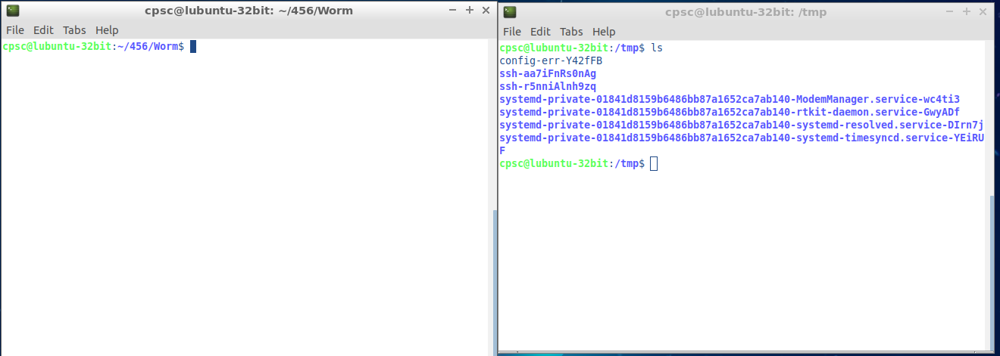
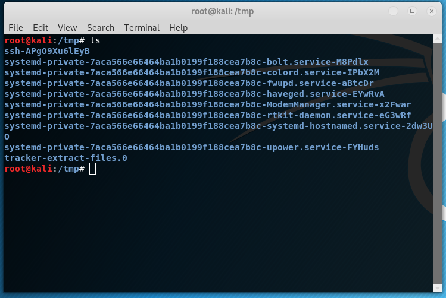
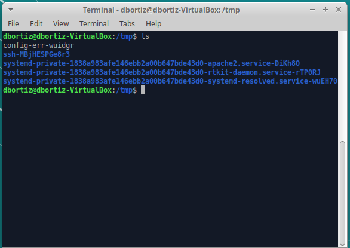
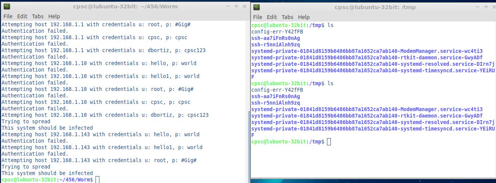
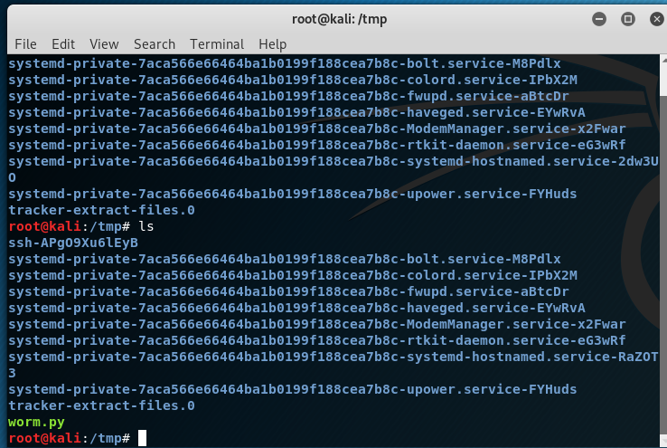
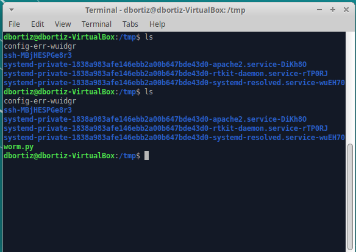
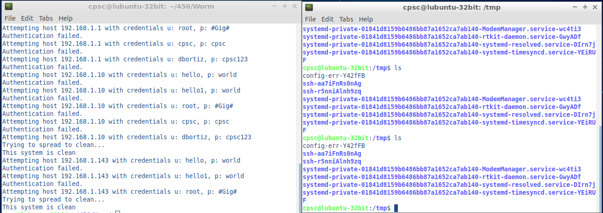
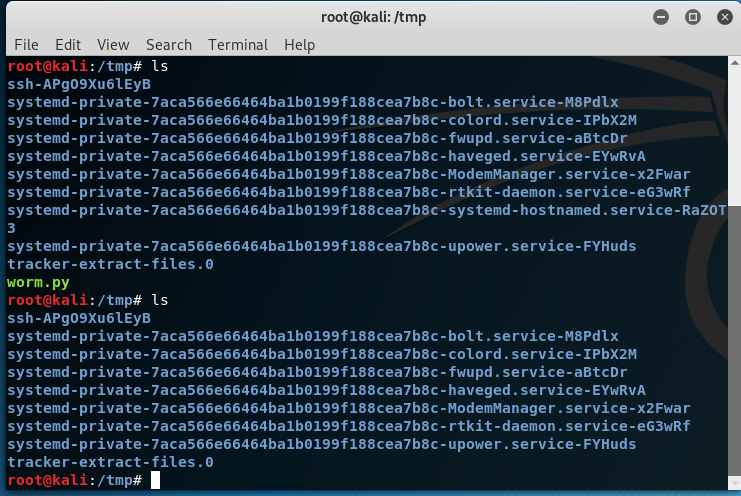
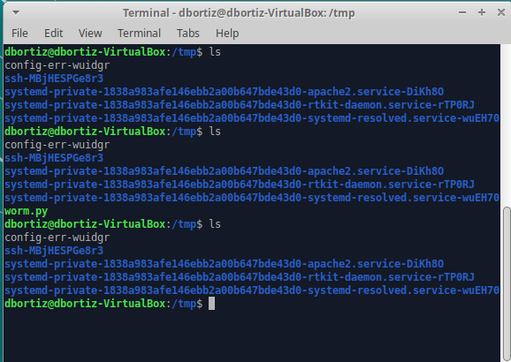

# Worm
Network Security Assignment #1  
Professor Manabat - CPSC 456 - F 9-11:45AM  

# Author
Dan Ortiz (dbortiz@csu.fullerton.edu)

# Language
Python

# How to execute
You first must choose a VM, within the internal network of VMs, which you want to execute the worm from. Once selected, you execute by typing: 
<strong>python worm.py</strong>

After the worm has been executed, it will begin to propagate through the network and begin infecting other VM systems.

# Before execution

<strong>I decided to choose this VM as my point of execution. As you will see, other VMs will become infected, but not this one.</strong>

# After execution

# Explanation
The first thing this program will do is find all the hosts within the network and save them to memory.
Afterward, it will use the pre-defined credentials for the other VMs and attempt to establish an SSH connection.
Once the connection is established, it will copy the worm onto the system (@ /tmp/) and change its permissions to execute.
It will then continue the spread from the new infected VM host and from its current point of execution.

# Extra Credit
I have implemented the extra credit which is to clean all infected VMs by removing the worm file.
In order to execute the clean function, type: 
<strong>python worm.py -c</strong> 
or 
<strong>python worm.py --clean</strong>

